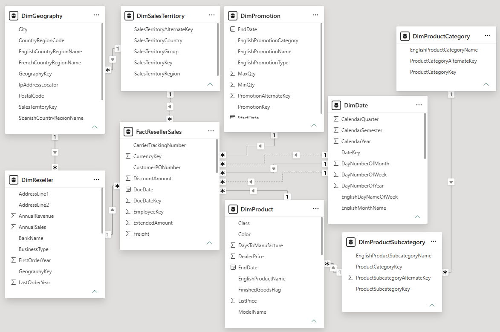
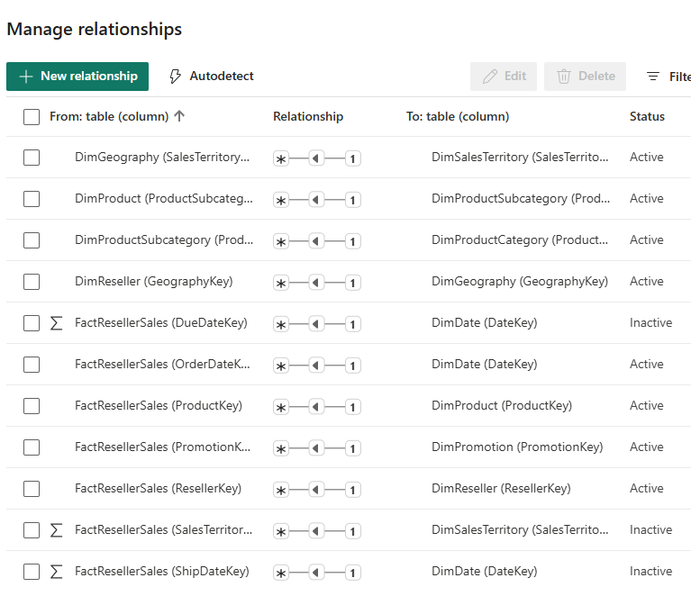
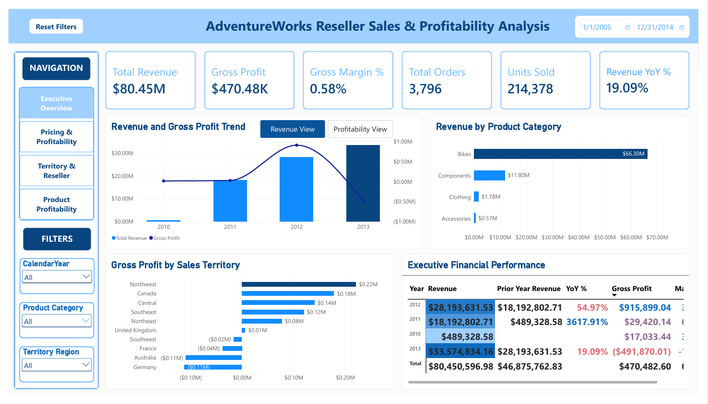
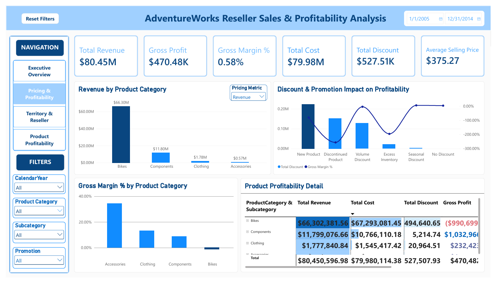
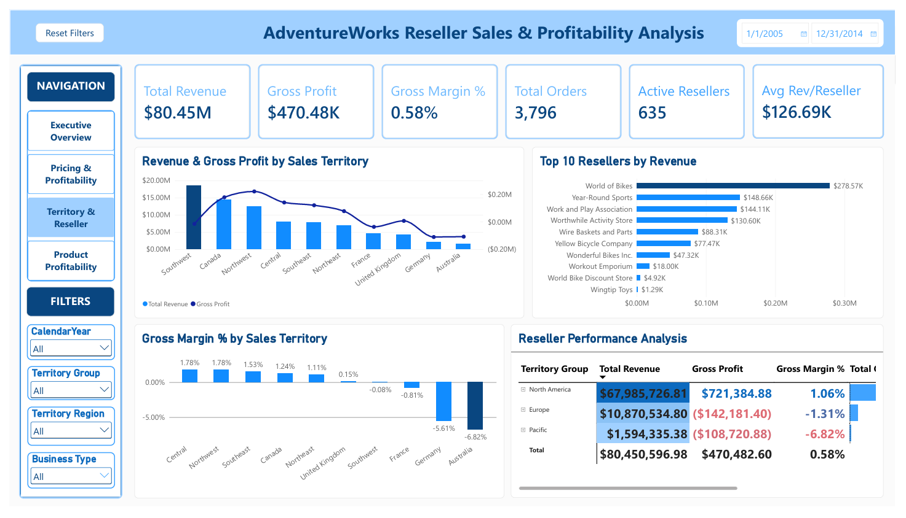
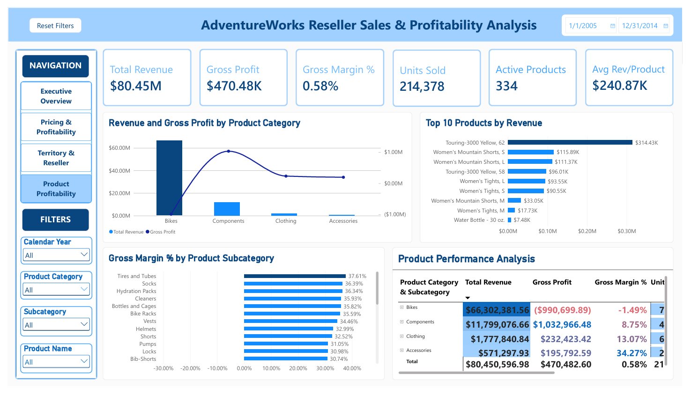

# AdventureWorks Sales Finance & Profitability Analytics

**End-to-End Portfolio Project | SQL Server • Excel • Power Query • Power BI • DAX**

**Focus:** Revenue • Pricing • Profitability • Margin Risk • Executive Decision Support

---

## 📌 Project Overview

This project is an end-to-end sales finance and profitability analysis using the AdventureWorks reseller sales dataset.

I used **SQL Server, Excel, Power Query, Power BI, and DAX** to investigate a central business problem: strong sales performance was not consistently translating into profitable growth.

The analysis moves from data exploration and financial KPI development to product, pricing, promotion, territory, reseller, and profitability diagnostics. Excel extends the analysis through variance and price-cost sensitivity modeling, while Power BI provides an interactive management dashboard for executive monitoring and deeper investigation.

**Dataset:** AdventureWorksDW2022

---

## 🎯 Business Problem

AdventureWorks generated substantial reseller sales revenue, but higher sales were not consistently translating into stronger profitability.

On a comparable **January–November basis**, 2013 revenue increased **31.52%** compared with the same period in 2012, while gross profit deteriorated by approximately **$1.59 million** and gross margin declined by **5.77 percentage points**.

### Central Business Question

> **Why was higher sales performance not translating into stronger profitability, and where was the profitability deterioration concentrated?**

---

## 🔎 Analysis Objectives

- Evaluate revenue, gross profit, and gross margin performance.
- Identify product categories and subcategories associated with profitability deterioration.
- Analyze below-cost pricing exposure.
- Test whether promotions and discounts sufficiently explain the losses.
- Compare profitability across territories and resellers.
- Evaluate hypothetical price and cost sensitivity scenarios.
- Develop management-focused KPIs and exception monitoring.

---


## 🗃️ Dataset & Analytical Model

The project uses the **AdventureWorksDW2022** data warehouse, with `FactResellerSales` as the primary transactional fact table.

The analytical model follows a dimensional structure that connects reseller sales transactions with product, date, reseller, and geographic dimensions to support financial and profitability analysis across multiple levels of detail.

### Core Tables

- `FactResellerSales` — reseller sales transactions, quantities, revenue, pricing, discounts, and product costs
- `DimDate` — calendar and time-based analysis
- `DimProduct` — individual product attributes
- `DimProductSubcategory` — product subcategory classification
- `DimProductCategory` — high-level product category classification
- `DimReseller` — reseller/customer attributes
- `DimSalesTerritory` — sales territory and geographic analysis

### Dataset Profile

- **60,855** sales lines
- **3,796** orders
- **214,378** units sold
- **$80.45M** total revenue
- Date range: **December 29, 2010 – November 29, 2013**

> **Comparable-Period Note:** The available 2013 reseller-sales data ends in November. Therefore, January–November periods were used for the primary 2012–2013 year-over-year diagnostic comparison.

### Power BI Data Model

The Power BI model connects the primary reseller-sales fact table to supporting dimensions for product, reseller, territory, and date analysis. This structure supports consistent KPI calculations and interactive filtering across the dashboard.



### Relationship Details

The relationship view documents the connections used across the analytical model and provides additional technical evidence of how the fact and dimension tables support cross-filtering and dashboard analysis.



---

## 🛠️ Tools & Technologies

| Technology | Application |
|---|---|
| **SQL Server / SSMS** | Data exploration, joins, validation, KPI calculations, and profitability diagnostics |
| **Excel** | Financial modeling, variance analysis, sensitivity analysis, and exception monitoring |
| **Power Query** | Data preparation and data-quality validation |
| **Power BI** | Interactive management dashboards and diagnostic analysis |
| **DAX** | Financial KPIs, comparable-period measures, and dynamic analysis |
| **AI-Assisted Analysis** | Development support, analytical validation, interpretation, and workflow refinement |

---

## ⚙️ End-to-End Analytical Workflow

**Data Exploration & Validation**  
↓  
**Financial KPI Development**  
↓  
**Profitability Diagnosis**  
↓  
**Product, Pricing & Promotion Investigation**  
↓  
**Territory & Reseller Investigation**  
↓  
**Excel Financial & Sensitivity Modeling**  
↓  
**Power BI Executive & Diagnostic Dashboard**  
↓  
**Management Decision Support**

---

## 🗄️ SQL — Profitability Investigation

SQL Server was used to establish the analytical foundation and progressively investigate the profitability problem.

### SQL Analysis Scripts

1. `01_Data_Exploration_and_Model.sql`
2. `02_Sales_and_Profitability_KPIs.sql`
3. `03_Product_and_Category_Profitability.sql`
4. `04_Price_vs_Cost_Analysis.sql`
5. `05_Reseller_and_Territory_Performance.sql`
6. `06_Promotion_and_Time_Trend_Analysis.sql`
7. `07_Volume_and_Exception_Analysis.sql`
8. `08_Executive_Summary.sql`

### SQL Skills Demonstrated

- Multi-table joins
- `CASE` expressions
- `GROUP BY`
- Aggregate functions
- Fact/dimension analysis
- Financial KPI calculations
- Product/category profitability analysis
- Price-versus-cost analysis
- Promotion and time-trend analysis
- Reseller and territory analysis
- Exception analysis
- Data validation

📂 **View the `/sql` folder for the complete analysis scripts.**

---

## 📗 Excel — Financial Modeling & Sensitivity Analysis

Excel was used to extend the SQL findings into financial modeling, variance analysis, pricing diagnostics, and scenario evaluation.

### Analytical Components

- Pricing Effectiveness
- Weekly Pricing Monitor
- Discount & Margin Model
- Performance Variance Analysis
- Price-Cost Sensitivity Analysis
- Two-Variable Data Tables
- Goal Seek
- Pricing Exception Watchlist
- Executive Dashboard

The sensitivity analysis evaluates how hypothetical changes in selling price and product cost could affect gross margin.

> **Important:** Scenario outputs are analytical decision-support tools and should not be interpreted as direct pricing recommendations.

---

## 📊 Power BI — Management Decision-Support Dashboard

The Power BI solution translates the financial analysis into four primary management views.

### 1. Executive Overview

Provides an executive-level view of revenue, gross profit, gross margin, and comparable-period financial performance.


### 2. Pricing & Profitability

Evaluates pricing effectiveness, below-cost exposure, gross margin, and promotion performance.


### 3. Territory & Reseller

Compares geographic and reseller performance across both revenue and profitability measures.


### 4. Product Profitability

Moves from category to subcategory and individual-product analysis to identify where profitability pressure is concentrated.


### Interactive Analysis

The report also incorporates:

- DAX financial measures
- Comparable-period analysis
- Slicers and filtering
- Bookmarks and navigation
- Field parameters
- Dynamic metric selection
- Dynamic titles
- Conditional formatting
- Report-page tooltips
- Drill-through analysis

---

## 🎥 Dashboard Walkthrough

Watch the complete Power BI dashboard walkthrough demonstrating how the analysis moves from executive-level financial performance into pricing, product, territory, reseller, and product-level diagnostic analysis.

▶️ **[Watch Dashboard Walkthrough on YouTube](https://youtu.be/8-vS-T1pzLs)**

---

## 🔍 Key Findings & Business Insights

- **Revenue growth did not translate into profitable growth.** Jan–Nov 2013 revenue increased **31.52%**, while gross profit deteriorated by approximately **$1.59M** and gross margin declined by **5.77 percentage points**.

- **Bikes were the dominant category-level contributor** to the profitability deterioration.

- **Touring Bikes were the largest subcategory-level contributor** to the deterioration within Bikes, while Road Bikes were also unprofitable.

- **40.27% of 2013 sales lines were below cost**, identifying below-cost exposure as a significant profitability risk signal.

- Road and Touring Bikes remained unprofitable within the **No Discount** population, indicating that promotional activity alone did not explain the profitability deterioration.

- Profitability varied across **territories, resellers, and individual products**, supporting targeted investigation rather than relying on revenue alone as a measure of performance.

---

## 💡 Management Takeaway

Revenue growth alone was not a sufficient indicator of business performance. The analysis showed that profitability deterioration was concentrated rather than random, with **Bikes—particularly Touring Bikes—emerging as a major area for deeper investigation**.

Below-cost exposure represented an additional profitability risk signal, while the promotion analysis showed that discounts alone could not explain the observed losses.

---

## 🎯 Recommendations & Decision Support

- Prioritize deeper investigation of **Touring and Road Bikes**.
- Review **selling price relative to standard cost** for below-cost transactions.
- Evaluate potential pricing and cost changes through controlled sensitivity analysis.
- Monitor reseller and territory **profitability alongside revenue**.
- Track **gross profit, gross margin, below-cost exposure, and pricing exceptions** over time.
- Use the Power BI dashboard as an ongoing profitability-monitoring and decision-support framework.

> Sensitivity scenarios do not model demand elasticity, competitive response, customer retention, or other commercial constraints and should therefore be evaluated alongside broader business considerations before implementation.

---

## 📈 Business Analysis Presentation

This management-focused presentation connects the analytical findings to business risks, diagnostic hypotheses, sensitivity analysis, corrective actions, and decision-support considerations.

▶️ **[Watch Business Analysis Presentation on YouTube](https://youtu.be/XNNkMtFnFeA?si=PdrLRdoJvU-pKReE)**

📥 **View the `/presentation` folder for the project presentation.**

---

## 📂 Repository Structure

```text
adventureworks-sales-finance-analytics/
│
├── sql/
│   ├── 01_Data_Exploration_and_Model.sql
│   ├── 02_Sales_and_Profitability_KPIs.sql
│   ├── 03_Product_and_Category_Profitability.sql
│   ├── 04_Price_vs_Cost_Analysis.sql
│   ├── 05_Reseller_and_Territory_Performance.sql
│   ├── 06_Promotion_and_Time_Trend_Analysis.sql
│   ├── 07_Volume_and_Exception_Analysis.sql
│   └── 08_Executive_Summary.sql
│
├── excel/
│   └── AdventureWorks_Sales_Finance_Analysis.xlsx
│
├── power-bi/
│   └── AdventureWorks_Sales_Profitability_Analysis.pbix
│
├── images/
│   ├── executive-overview.png
│   ├── pricing-profitability.png
│   ├── territory-reseller.png
│   ├── product-profitability.png
│   ├── product-detail.png
│   └── data-model.png
│
├── presentation/
│   └── AdventureWorks_Sales_Profitability_Business_Analysis_Tina_Vo.pptx
│
└── README.md
